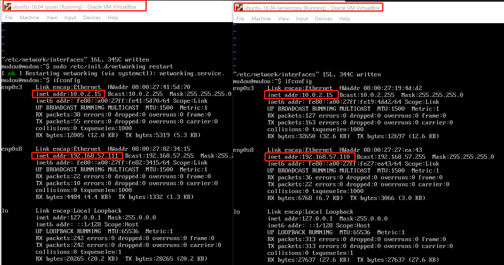
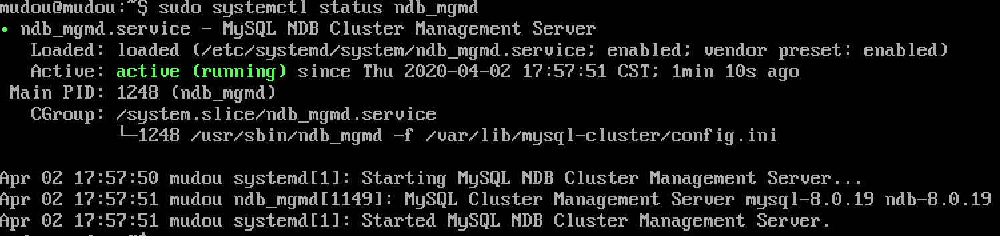
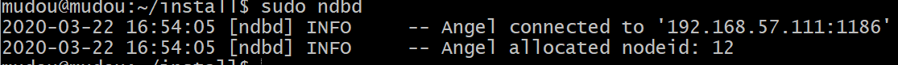
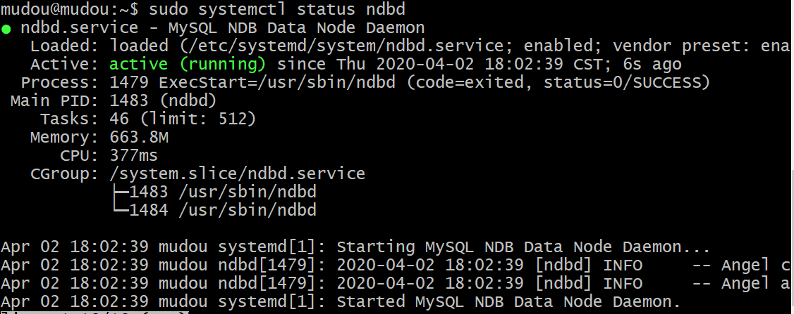
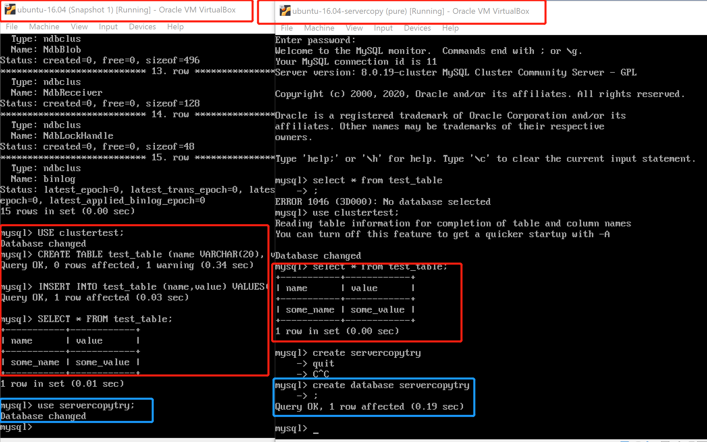

# 部署MySQL Cluster集群系统
## 实验环境
virtualbox+ubuntu-16.04-server(两个)  
ubuntu双网卡配置：NAT+host-only
* 如果没有开启host-only.```sudo vi /etc/network/interfaces```在其中添加```auto enp0s8```和```iface enp0s8 inet dhcp```，最后```sudo /etc/init.d/networking restart```重启网络


## 实验步骤
1. 下载安装VM ware12.5.9并安装，运行输入激活许可证。
* 之后由于分辨率的问题，改用virtual box
2. 下载ubuntu-16.04-server.iso。安装虚拟机。
* 在vm ware一开始选择iso进行安装其实就是无人值守？比之后再添加有什么区别吗？-没有解决
* [ubuntu安装增强套件](https://blog.csdn.net/Jacob_job/article/details/80247103)
3. 根据linux操作系统选择正确的版本，[下载Mysql cluster](http://dev.mysql.com/downloads/cluster/),本次实验下载mysql-cluster_8.0.19-1ubuntu16.04_amd64.deb-bundle.tar，并ssh传入到ubuntu虚拟机中。两个ubuntu都使用如下命令。 
```
# 以下命令安装mysql cluster包
mkdir install
tar -xvf mysql-cluster.tar -C install/
cd install
sudo apt update && sudo apt install libaio1 libmecab2
```

4. 以下设置Cluster Manager 服务器 (假定为 192.168.57.111)
```
# 安装配置集群管理器
# 用dpkg指令安装 ndb_mgmd
sudo dpkg -i mysql-cluster-community-management-server_8.0.19-1ubuntu16.04_amd64.deb

# 在第一次运行ndb_mgmd前需要对其进行配置，正确配置是保证数据节点正确同步和负载分配的前提。
# Cluster Manager 应该是MySQL Cluster 第一个启动的组件.它需要一个配置文件来加载参数. 因此创建配置文件: /var/lib/mysql-cluster/config.ini.
#在Cluster Manager 所在机器上创建 /var/lib/mysql-cluster目录
sudo mkdir /var/lib/mysql-cluster
sudo vim /var/lib/mysql-cluster/config.ini
```

config.ini具体内容如下：
```
[ndbd default]
# Options affecting ndbd processes on all data nodes:
NoOfReplicas=2  # Number of replicas

[ndb_mgmd]
# Management process options:
hostname=192.168.57.111  # Hostname of the manager
NodeId=1
datadir=/var/lib/mysql-cluster  # Directory for the log files

[ndbd]
hostname=192.168.57.110 # Hostname/IP of the first data node
NodeId=11            # Node ID for this data node
datadir=/usr/local/mysql/data   # Remote directory for the data files

[ndbd]
hostname=192.168.57.111 # Hostname/IP of the second data node
NodeId=12            # Node ID for this data node
datadir=/usr/local/mysql/data   # Remote directory for the data files

[mysqld]
# SQL node options:
hostname=192.168.57.111 # MySQL server/client i manager

[mysqld]
# SQL node options:
hostname=192.168.57.110 # MySQL server/client i manager
```
启动mysql服务
```
# 杀掉正在运行的服务
sudo pkill -f ndb_mgmd
# 检查ndb_mgmd 使用的端口 1186：
sudo netstat -plntu
# 启动管理器
sudo ndb_mgmd -f /var/lib/mysql-cluster/config.ini
```
可以使ndb_mgmd自动加载，使用下列命令，不配置自动加载不影响对集群的认识，自动加载更符合实际。本次实验均设置了自启动。
```
# 编辑systemd Unit文件，使服务可以自动加载
# 内容如下
[Unit]
Description=MySQL NDB Cluster Management Server 
After=network.target auditd.service

[Service]
Type=forking
ExecStart=/usr/sbin/ndb_mgmd -f /var/lib/mysql-cluster/config.ini
ExecReload=/bin/kill -HUP $MAINPID
KillMode=process
Restart=on-failure

[Install]
WantedBy=multi-user.target

# 采用daemon-reload重新加载systemd’s manager 配置
sudo systemctl daemon-reload
让我们刚创建的服务生效，使MySQL Cluster Manage 可以开机执行:
Shell>sudo systemctl enable ndb_mgmd

最后，启动服务：
Shell> sudo systemctl start ndb_mgmd

可以通过如下语句验证NDB Cluster Management service服务正在执行：
Shell>sudo systemctl status ndb_mgmd
```
如果开启了自启动，看到如下结果


5. 配置数据节点(192.168.57.111和192.168.57.110上都进行)
```
# 安装依赖包
sudo apt-get –f install && sudo apt install libclass-methodmaker-perl
# 安装数据节点包
cd install
sudo dpkg -i mysql-cluster-community-data-node_8.0.19-1ubuntu16.04_amd64.deb
# 数据节点将从固定位置/etc/my.cnf获取配置文件.创建文件并编辑:
sudo vim /etc/my.cnf
#内容如下：
[mysql_cluster]
# Options for NDB Cluster processes:
ndb-connectstring=192.168.57.111  # location of cluster manager
# 本配置设定在管理器配置数据目录为 /usr/local/mysql/data. 运行服务前要创建相关目录:
sudo mkdir -p /usr/local/mysql/data
# 然后就可以启动服务了：
sudo ndbd
```
NDB 数据节点守护程序成功启动

配置数据节点服务自启动
* 如果开启了自启动，前面的结果就不会出现，是正常的，并且使用```sudo ps -A```会看到两个ndbd进程
```
# 打开并编辑如下 systemd Unit 文件:
sudo vim /etc/systemd/system/ndbd.service
# 内容如下:

[Unit]
Description=MySQL NDB Data Node Daemon
After=network.target auditd.service

[Service]
Type=forking
ExecStart=/usr/sbin/ndbd
ExecReload=/bin/kill -HUP $MAINPID
KillMode=process
Restart=on-failure

[Install]
WantedBy=multi-user.target

# 这里只是加入了如何启动、停止和重启动ndbd进程的最小选项集合. 想要知道更多的相关信息，参阅systemd manual.

# 采用daemon-reload重新加载systemd’s manager 配置:
sudo systemctl daemon-reload

# 让我们刚创建的服务生效，使data node daemon 可以开机执行:
sudo systemctl enable ndbd

# 最后，启动服务：
sudo systemctl start ndbd
# 可以通过如下语句验证NDB Cluster Management service服务正在执行：
sudo systemctl status ndbd
```
status如下图所示

这表明MySQL Cluster 数据节点守护进程作为一个 systemd service在运行. 数据节点起作用并能够连接到MySQL Cluster Manager.  


6. 配置并运行MySQL Server 和 Client(192.168.57.111和192.168.57.110上都进行)

```
# 进入包含MySQL Cluster组件的目录:
cd install

# 然后安装解压在install目录的软件包中的一些MySQL Cluster 依赖包:
sudo dpkg -i mysql-common_8.0.19-1ubuntu16.04_amd64.deb

sudo dpkg –i mysql-cluster-community-client-core_8.0.19-1ubuntu16.04_amd64.deb

sudo dpkg -i mysql-cluster-community-client_8.0.19-1ubuntu16.04_amd64.deb

sudo dpkg -i mysql-client_8.0.19-1ubuntu16.04_amd64.deb

sudo dpkg -i mysql-cluster-community-server-core_8.0.19-1ubuntu16.04_amd64.deb

sudo dpkg -i mysql-cluster-community-server_8.0.19-1ubuntu16.04_amd64.deb
#输入密码并选择强密码

# 安装mysql server
sudo dpkg -i mysql-server_8.0.19-1ubuntu16.04_amd64.deb

# 配置MySQL server
sudo vim /etc/mysql/my.cnf
# 添加以下内容
[mysqld]
# Options for mysqld process:
ndbcluster                      # run NDB storage engine

[mysql_cluster]
# Options for NDB Cluster processes:
ndb-connectstring=192.168.57.111  # location of management server
# 重启 MySQL server
sudo systemctl restart mysql
# 启动
sudo systemctl enable mysql
```

7. 验证MySQL Cluster安装
```
# 登录Cluster Manager / SQL Server节点(192.168.57.111)
mysql -u root -p  
# 显示 NDB引擎的相关信息
SHOW ENGINE NDB STATUS \G
# 退出。  
# 查看集群信息
ndb_mgm
SHOW
```  
* 如果是正确的操作可以看到引擎信息中
number of ready_data_nodes= 2.且集群信息中所有的结点都已连接，如果不一样就是没有连接成功。
7. 向MySQL集群插入数据
```
# 首先, 创建数据库clustertest:
CREATE DATABASE clustertest;

# 其次转到新数据库:
USE clustertest;

# 再次，创建表test_table:
CREATE TABLE test_table (name VARCHAR(20), value VARCHAR(20)) ENGINE=ndbcluster;

# 这里需要显式规定ndbcluster引擎.插入数据了:
INSERT INTO test_table (name,value) VALUES('some_name','some_value');

# 最后验证数据插入：
SELECT * FROM test_table;
```
## 实验问题
1. 遇到了一个问题number of ready_data_nodes= 0.且集群信息中的结点有一个没有连接。  
解决：因为另一个虚拟机中的数据库没有搭好，将步骤中的5也在另一台中操作一遍
## 实验结论
1. 在本例中，数据被插入到了哪个机器？  
根据实验结果发现，集群中的数据库操作是同步的。比如在server创建了数据库clustertest并创表插入数据，而client也能使用该库并查询数据。在client创建数据库，立刻server（为一个数据节点）就可以使用这个名为'servercopytry'的库

2. 通过实验，你对一个分布式数据库系统有何理解？分布式数据库系统预计有何优越性？  
理解:分布式数据库物理上分离（位于不同的主机），但是逻辑同步（操作同步）  
优越性：实现了数据同步，很方便。
3. 你能设计一个方案验证集群系统在可靠性上优于集中式数据库系统吗？  
[mysql集群和分布式的区别](https://blog.csdn.net/paolei/article/details/100145421)解决了我对集群数据库会不会死锁的困惑。  
[分布式与集中式的区别](https://blog.csdn.net/qq_27093465/article/details/78195489)  
验证方案：都是用三台主机（一个server，两个client），分布式对于数据的处理，两个client同步，而集中式是有延迟的。
4. 同样是插入数据，你觉得MySQL Cluster和myCAT 在实体完整性保持方面是否可能会有不同？为什麽？
myCAT是定义表的分片规则，有利于读写分离。集群是以节点类型来分片的。
