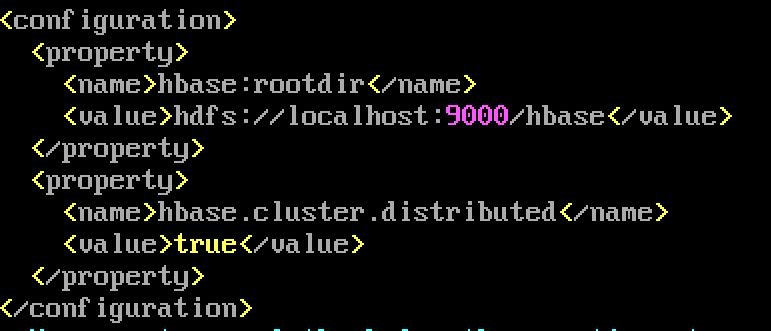
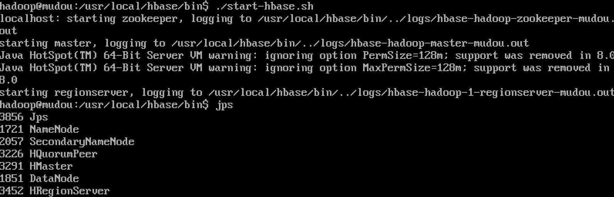

# noSQL数据库系统Hadoop的安装与简单使用（伪分布模式）


## 实验步骤
### 一、实验环境准备
1. 创键一个实验用户（此处为hadoop）
```
$ sudo useradd -m hadoop -s /bin/bash  #创建hadoop用户，并使用/bin/bash作为shell
$ sudo passwd hadoop                   #为hadoop用户设置密码，之后需要连续输入两次密码
$ sudo adduser hadoop sudo             #为hadoop用户增加管理员权限
$ su - hadoop                          #切换当前用户为用户hadoop
$ sudo apt-get update                  #更新hadoop用户的apt,方便后面的安装

```
2. 安装SSH,设置SSH无密码登陆
```
$ sudo apt-get install openssh-server   #安装SSH server
$ ssh localhost                         #登陆SSH，第一次登陆输入yes
$ exit                                  #退出登录的ssh localhost
$ cd ~/.ssh/                            #如果没法进入该目录，执行一次ssh localhost
$ ssh-keygen -t rsa                     #三次回车
$ cat ./id_rsa.pub >> ./authorized_keys     #加入授权
$ ssh localhost                         #此时已不需密码即可登录localhost
```
实验效果如下图：

### 二、安装jdk1.8
```
$ mkdir /usr/lib/jvm                              #创建jvm文件夹
$ sudo tar zxvf  jdk-8u201-linux-x64.tar.gz  -C /usr/lib/jvm  #/ 解压到/usr/lib/jvm目录下
$ cd /usr/lib/jvm                                 #进入该目录
$ mv  jdk1.8.0_201 java                         #重命名为java
$ vi ~/.bashrc                                 #给JDK配置环境变量

#在.bashrc文件添加如下指令：

export JAVA_HOME=/usr/lib/jvm/java
export JRE_HOME=${JAVA_HOME}/jre
export CLASSPATH=.:${JAVA_HOME}/lib:${JRE_HOME}/lib:$CLASSPATH
export PATH=${JAVA_HOME}/bin:$PATH

```
.bashrc文件修改如图所示：

```
$ source ~/.bashrc                       #使新配置的环境变量生效
$ java -version                          #检测是否安装成功，查看java版本
```
安装成功显示如下图：

### 三、安装hadoop-3.1.2
```
$ sudo tar -zxvf  hadoop-3.1.2.tar.gz  -C  /usr/local    #解压到/usr/local目录下
$ cd /usr/local
$ sudo mv  hadoop-3.1.2    hadoop                     #重命名为hadoop
$ sudo chown -R hadoop ./hadoop         #修改文件权限，根据实际情况确定用户名

vim ~/.bashrc
给hadoop配置环境变量，将下面代码添加到.bashrc文件:

export HADOOP_HOME=/usr/local/hadoop
export HADOOP_COMMON_LIB_NATIVE_DIR=$HADOOP_HOME/lib/native
export PATH=$PATH:$HADOOP_HOME/bin:$HADOOP_HOME/sbin

```
hadoop安装成功如下图：

#### 伪分布式配置
伪分布式需要修改2个配置文件 core-site.xml 和 hdfs-site.xml 
```
#进入配置文件所在文件夹
cd /usr/local/hadoop/etc/hadoop/
#修改hadoop-env.sh文件
vim hadoop-env.sh
# 添加以下内容
export JAVA_HOME=/usr/lib/jvm/java

#修改core-site.xml文件
vim core-site.xml
#添加以下内容
<configuration>
  	      <property>
             <name>hadoop.tmp.dir</name>
             <value>file:/usr/local/hadoop/tmp</value>
             <description>Abase for other temporary directories.</description>
        </property>
        <property>
             <name>fs.defaultFS</name>
             <value>hdfs://localhost:9000</value>
        </property>
</configuration>


#修改hdfs-site.xml文件
vim hdfs-site.xml
#添加以下内容
<configuration>
        <property>
             <name>dfs.replication</name>
             <value>1</value>
        </property>
        <property>
             <name>dfs.namenode.name.dir</name>
             <value>file:/usr/local/hadoop/tmp/dfs/name</value>
        </property>
        <property>
             <name>dfs.datanode.data.dir</name>
             <value>file:/usr/local/hadoop/tmp/dfs/data</value>
        </property>
</configuration>
```
* 如果需要从伪分布式模式切换回非分布式模式，需要删除 core-site.xml 中的配置项。此外，伪分布式虽然只需要配置 fs.defaultFS 和 dfs.replication 就可以运行（可参考官方教程），不过若没有配置 hadoop.tmp.dir 参数，则默认使用的临时目录为 /tmp/hadoo-hadoop，而这个目录在重启时有可能被系统清理掉，导致必须重新执行 format 才行。所以我们进行了设置，同时也指定 dfs.namenode.name.dir 和 dfs.datanode.data.dir，否则在接下来的步骤中可能会出错。
```
# 执行 NameNode 的格式化
$ ./bin/hdfs namenode –format
```
namenode格式化结果如下图：

```
# 启动namenode和datanode进程，并查看启动结果
$ ./sbin/start-dfs.sh
$ jps
```
结果如下图所示：

运行例子测试
```
创建执行MapReduce作业所需的 DFS 目录:

  $ bin/hdfs dfs -mkdir /user
  $ bin/hdfs dfs -mkdir /user/<username>     //<username> 问用户名，如hadoop

拷贝输入文件到分布式文件系统:

  $ bin/hdfs dfs  -put  etc/hadoop  input

可以运行一些例子:

  $ bin/hadoop jar share/hadoop/mapreduce/hadoop-mapreduce-examples-3.1.2.jar grep input output 'dfs[a-z.]+'

查看输出的文件(files): 从分布式文件系统中拷贝文件到本地文件系统并查看:

  $ bin/hdfs dfs -get output output
  $ cat output/*

或者直接在分布式文件系统上查看:

  $ bin/hdfs dfs -cat output/*

```
比如，进入到'share/hadoop/mapreduce/'后执行```jar hadoop-mapreduce-examples-3.1.2.jar grep input output 'dfs[a-z.]+'```得到的结果如下图

#### YARN 单机配置
```
# 进入配置文件的文件夹
cd /usr/local/hadoop/etc/hadoop/ 

# 配置mapred-site.xml如下 :
<configuration>
    <property>
        <name>mapreduce.framework.name</name>
        <value>yarn</value>
    </property>
</configuration>

#配置yarn-site.xml如下
<configuration>
    <property>
        <name>yarn.nodemanager.aux-services</name>
        <value>mapreduce_shuffle</value>
    </property>
</configuration>

#启动ResourceManager daemon 和 NodeManager daemon:
$ sbin/start-yarn.sh

#下列命令停止hadoop和YARN
$ sbin/stop-dfs.sh
$ sbin/stop-yarn.sh
```
### 四、安装Hbase和简单使用 
```
#解压安装包hbase-1.2.11-bin.tar.gz至路径 /usr/local，命令如下：
sudo tar -zxvf  hbase-1.2.11-bin.tar.gz -C /usr/local
#将解压的文件名hbase-1.2.11改为hbase，以方便使用，命令如下：
sudo mv /usr/local/hbase-1.2.11  /usr/local/hbase
cd /usr/local
$ sudo chown -R hadoop ./hbase 
#将hbase下的所有文件的所有者改为hadoop，hadoop是当前用户的用户名。

#配置环境变量
vim ~/.bashrc
#添加以下代码：
export SPARK_HOME=/usr/local/spark
export PATH=$PATH:${SPARK_HOME}/bin
export PATH=$PATH:/usr/local/habse
#使设置生效
source ~/.bashrc
```
#### HBase配置 
##### 单机配置（可能需要配置JAVA_HOME环境变量， 由于本实验指南在HADOOP安装时已配置，故省略。本次实验没有使用此配置方式。）
```
# 配置hbase-site.xml文件
vim /usr/local/hbase/conf/hbase-site.xml
```
如下图配置

```
采用如下命令启动服务、查看进程和启动客户端
$ cd /usr/local/hbase
$ bin/start-hbase.sh
$jps
$ bin/hbase shell
```

#### 配置伪分布模式（本次实验使用伪分布模式）

##### 1. 配置hbase-site.xml
```
vim /usr/local/hbase/conf/hbase-site.xml
``` 
内容如下图：

```
$ start-dfs.sh
$ cd /usr/local/hbase/bin
$ ./start-hbase.sh
```

##### 2.查看DFS中Hbase 目录，自动创建
```
#查看DFS中Hbase 目录，自动创建
hdfs dfs -ls /hbase
```
```
#启动和停止附加区域服务器RegionServers
./local-regionservers.sh start 2 3 4 5
```
结果如下图

```
#用 localmaster-backup.sh启动. 为每个后背HMaster加一个16000端口之上的偏移量。 启动后可以查看结果。
#停止将start改为stop
./local-master-backup.sh start/stop 2 3 5
#jps查看结果
jps
```
结果如下图


```
$ cd /usr/local/hbase
$ bin/start-hbase.sh
```
进入hbase shell,结果如下图所示
 
##### 3.进行一些基本数据库操作

还有修改表模式，使用alter命令，如修改存储版本数
```
hbase(main):007:0>disable ’test’ 
hbase(main):007:0>alter ’test’, NAME=>’cf’,VERSIONS=>5
hbase(main):007:0>enable ’test’
```
其他命令 disable table, drop table,enable table 等。

## 实验问题
1. scp后找不到文件？  
解决：进入/home文件查看，scp拷贝到了哪个权限，就在哪个权限的文件夹下
2. namenode格式化使出错，报错如下图

解决：文件内容写错了，排除了一遍后解决。
3. namenode格式化Logs文件夹权限出错  
解决：```sudo chmod -R 777 /usr/local/hadoop/logs```  
[参考](https://segmentfault.com/a/1190000020378682)
4. jps出现报错
  
解决：```sudo chown -R hadoop tmp```后再启动。
5. ```./start-hbase.sh```没有java环境变量的报错,如下图所示：
  
解决：

6. 进入hbase shell以后第一步创建表，出现格式报错

解决：先启动regionserver再启动hmaster。  
[参考](https://community.cloudera.com/t5/Support-Questions/org-apache-hadoop-hbase-PleaseHoldException-Master-is/td-p/131710)
## 实验结论
1. 请问伪分布和分布式的含义有何不同？就本实验，你是如何理解在一台计算机上做到“伪分布”的？  
答：伪分布是逻辑上的分布，实际上是在一个物理机上操作。分布式是物理机上分布，逻辑上集中。  
以本次实验为例，之前的实验是一个物理机为master，其余物理机当数据节点，而这次实验，是在一个物理机上实现了既有master又有数据节点。
2. 在1.2小节进行安装SSH并设置SSH无密码登陆，请问这个安装的目的是什么？  
答：为了不需密码即可登录localhost。如果失败则可以搜索SSH免密码登录来寻求答案
3. 如果继续向Hbase的test表中put行键为”row1”，值为其它字符串的数据，put ‘test’ ,’row1’, ‘cf:a’, ‘value6’，会发生什么？如果采用语句get ‘test’, ‘row1’, {COLUMN=>’cf:a’, VERSIONS=>3} 进行查询，分析你得到的结果。put与关系数据库的插入有何不同？  
题目中的实验执行结果如下图所示：
  
put与关系数据库的插入不同：HBase数据插入使用Put对象，Put对象在进行数据插入时，首先会想Hbase集群发送一个RPC请求，得到响应后将Put类中的数据通过序列化的方式传给HBase集群，集群节点拿到数据后进行添加功能。  
或：Put类中主要含有一个KeyValue对象数组，KeyValue对象是HBase底层存储的一个重要类，代表了数据在底层存储时的状态。KeyValue对象代表了一个Hbase表中的一个数据单元，即含有行值（row）、列簇（family）、列（column）、时间戳（timestamp）和值（value），从这些信息能够在表中唯一确定一个数据单元。在KeyValue对象中，Key（键）包含了一个value值的row、family、column和timestamp信息，而value则是该表单元格的数据。  当插入一条数据时，其实就是讲KeyValue进行序列化后，然后传递后Hbase集群，集群在根据KeyValue的值进行相应的操作。  
而关系数据库没有这样的过程，直接根据属性插入。
## 参考文献
[hadoop](https://www.sas.com/en_us/insights/big-data/hadoop.html)  
[Apahce hadoop](https://hadoop.apache.org/docs/stable/hadoop-project-dist/hadoop-common/SingleCluster.html)  
[hbase](https://hbase.apache.org/book.html)