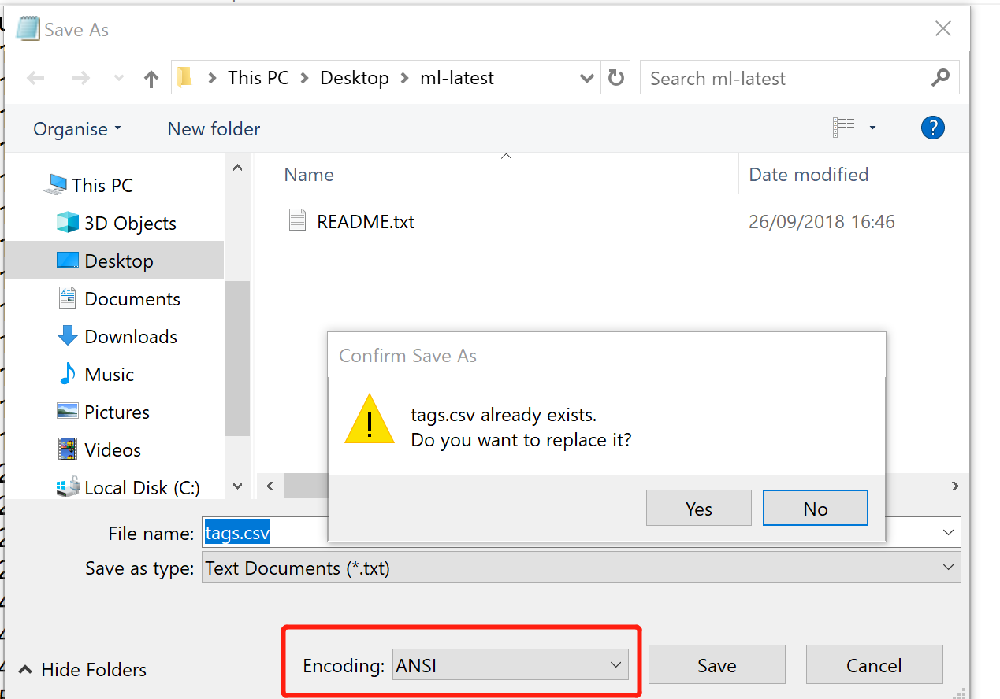

# 分组综合实验作业
##  实验要求
开发一个基于客户服务器或WEB的数据库应用，这个应用是查询一个关于电影数据库的数据，数据部分信息经过了脱密处理，数据及相关数据文档由教师指定。开发的基本功能需求如下：
- [] 1.	搜索任务：A：根据用户ID，搜索用户所看的电影名字和评分，按时间从新到旧排序，给出电影的前三个标签及关联度评分；B: 根据输入的关键词，查询电影名字里有关键词的电影。C：查询某一风格最受欢迎的20部电影（请给出你的最受欢迎的定义，风格数据处理较难，需要精心设计），D：根据性别推荐最受欢迎的电影20部电影。
- [] 2.	界面规范： 界面上应该有录入用户ID, 检索关键词、风格等的文本框和不同任务的提交按钮，风格最好提供选择框。 搜索结果要在网页上或客户端图形UI 展示，超过一页的要有滚动条。
- [] 3.	用户希望界面友好。
- [] 4.	系统可以支持未来数据量的大幅增加。
- [] 5.	各组尽可能地做查询速度的优化，并在最后提交的文档中包含测试结果。
## 实验环境
python3.7.3+flask0.12.2+mysql cluster8.0.19(win10)的web数据库应用程序  

## 实验步骤
### 一. 在实验01-deploy-mysql的基础上配置mysql cluster，开启mysql cluster(配置时使用自启动)并确保一切正常。
```
# 杀掉正在运行的服务
sudo pkill -f ndb_mgmd
# 检查ndb_mgmd 使用的端口 1186：
sudo netstat -plntu
# 启动管理器
sudo ndb_mgmd -f /var/lib/mysql-cluster/config.ini

# 最后，启动服务：
Shell> sudo systemctl start ndb_mgmd
# 可以通过如下语句验证NDB Cluster Management service服务正在执行：
Shell>sudo systemctl status ndb_mgmd


# 最后，启动服务：
sudo systemctl start ndbd
# 可以通过如下语句验证NDB Cluster Management service服务正在执行：
sudo systemctl status ndbd

# 启动mysql
sudo systemctl enable mysql

# 登录Cluster Manager / SQL Server节点(192.168.57.111)
mysql -u root -p  
# 显示 NDB引擎的相关信息
SHOW ENGINE NDB STATUS \G
# 退出。  
# 查看集群信息
ndb_mgm
SHOW
```
### 二. 配置物理机远程连接虚拟机中的数据库,使用test.py进行数据测试。
>数据测试代码文件：code/test.py
1. virtualbox中进行如下设置：  

2. 运行python依然得到报错信息：'Host '192.168.57.1' is not allowed to connect to this MySQL server'.  
解决：参考[Host 'xxx.xx.xxx.xxx' is not allowed to connect to this MySQL server](https://stackoverflow.com/questions/1559955/host-xxx-xx-xxx-xxx-is-not-allowed-to-connect-to-this-mysql-server)对mysql cluster进行授权  
```
# 在虚拟机中操作
mysql -u root -p

#username为远程访问时要使用的
CREATE USER 'username'@'localhost' IDENTIFIED BY 'password';

GRANT ALL PRIVILEGES ON *.* TO 'username'@'localhost' WITH GRANT OPTION;

CREATE USER 'username'@'%' IDENTIFIED BY 'password';

GRANT ALL PRIVILEGES ON *.* TO 'username'@'%' WITH GRANT OPTION;

FLUSH PRIVILEGES;
```
本次实验创建username:mudou,localhost:192.168.57.1(host-only网络),password:123456
* 192.168.57.1的结果来自查看本次响应Host-only网络中的ipv4

具体mysql cluster授权实验操作如下：

3. 最后测试成功，看到打印出的数据，确实是当初插入其中的数据。(数据是在实验01-deploy-mysql中插入的数据) 

### 三、虚拟机中导入数据
1. 下载老师给的数据包，将文件另存为ANSI编码
  
2. 
### 四、前端搭建
## 实验问题
1. 远程访问虚拟机数据时```grant all privileges on *.* to user@'%' identified by 'password';```一直报错。    
  
解决：因为没有create该用户，先create再授权。 而且一开始没有好好理解比如问题语句其中'user'和'%'的含义。   
## 实验总结


## 参考文献
[【MySQL集群】——在Windows环境下配置MySQL集群](https://blog.csdn.net/huyuyang6688/article/details/47441743)  
[MySQL Cluster: Getting Started](https://www.mysql.com/products/cluster/start.html)  
[NDB Cluster](https://en.wikipedia.org/wiki/NDB_Cluster)  
[解决VirtualBox中的MySQL数据库，Mac无法访问的问题（通过端口映射的方式）](https://blog.csdn.net/u010921373/article/details/70255427)  
[利用端口转发访问VirtualBox虚拟机中的MySQL](http://www.jeepxie.net/article/85094.html)  
[Differences Between MySQL vs MongoDB](https://www.educba.com/mysql-vs-mongodb/)  
[Differences Between MongoDB and HBase](https://www.educba.com/mongodb-vs-hbase/)  
[What is MySQL NDB Cluster?](https://www.apress.com/us/blog/all-blog-posts/what-is-mysql-ndb-cluster/15454530)  
[MySQL Cluster CGE ](https://www.mysql.com/products/cluster/)
