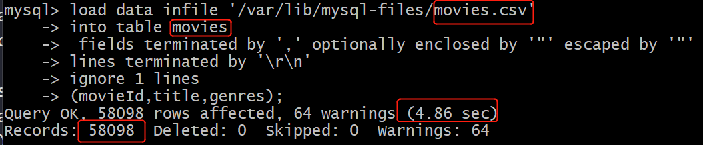
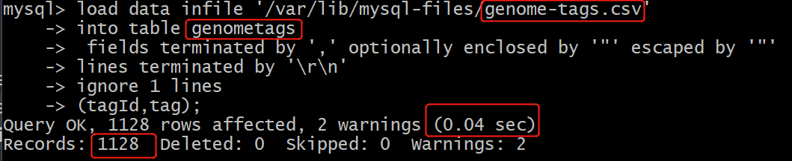
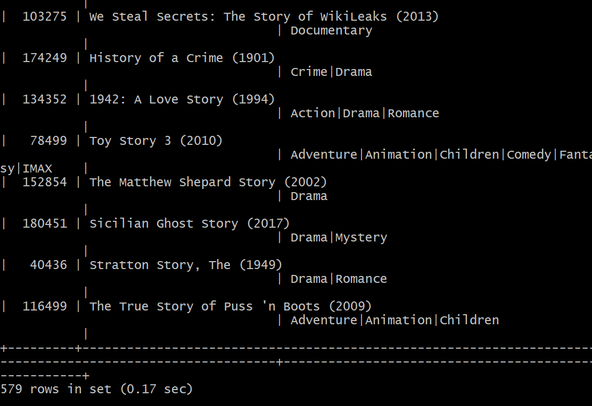
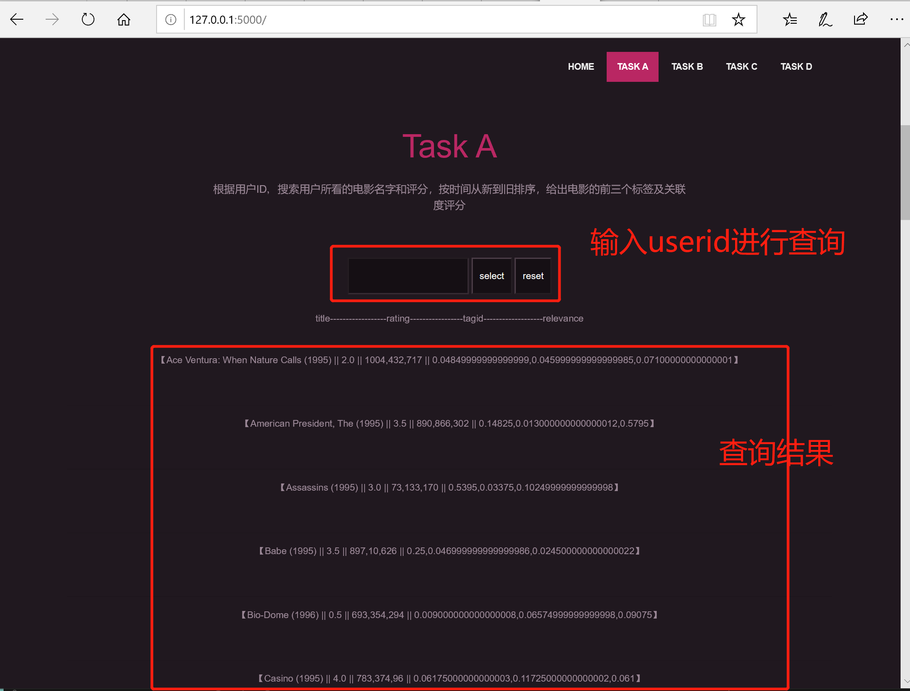

# 分组综合实验作业
##  实验要求
开发一个基于客户服务器或WEB的数据库应用，这个应用是查询一个关于电影数据库的数据，数据部分信息经过了脱密处理，数据及相关数据文档由教师指定。开发的基本功能需求如下：
- [x] 1. 搜索任务：  
A：根据用户ID，搜索用户所看的电影名字和评分，按时间从新到旧排序，给出电影的前三个标签及关联度评分。  
B: 根据输入的关键词，查询电影名字里有关键词的电影。  
C：查询某一风格最受欢迎的20部电影（请给出你的最受欢迎的定义，风格数据处理较难，需要精心设计）。  
D：根据性别推荐最受欢迎的电影20部电影。
- [x] 2. 界面规范：  
界面上应该有录入用户ID, 检索关键词、风格等的文本框和不同任务的提交按钮，风格最好提供选择框。  
搜索结果要在网页上或客户端图形UI展示，超过一页的要有滚动条。
- [x] 3.	用户希望界面友好。
- [x] 4. 系统可以支持未来数据量的大幅增加。
- [x] 5. 各组尽可能地做查询速度的优化，并在最后提交的文档中包含测试结果。
## 实验环境
python3.7.3+flask0.12.2+mysql cluster8.0.19(win10)的web数据库应用程序  

* 为什么选择mysql cluster?  
1. mysql cluster vs mongodb:  
参考[Differences Between MySQL vs MongoDB](https://www.educba.com/mysql-vs-mongodb/)。  
mysql是关系型数据库，Mongodb是Nosql数据库，mysql使用sql查询语句，Mongodb的存储文件是类json文件，查询较慢。  
2. Mysql cluster vs Hbase:  
参考[System Properties Comparison HBase vs. MySQL](https://db-engines.com/en/system/HBase%3BMySQL).  
mysql cluster支持的编程语言更多，支持外键关联（我们这一次的表格关系复杂，可能会用到），Mysql是关系型数据库。HBase是宽列存储数据库，更适合数据分析和数据比对，没有实时数据访问。Hbase可以在线扩展(添加/删除)region server，来达到mysql cluster需要配置重启服务来开启和关闭数据节点的效果，但本次实验我们并不需要很多的数据节点。
3. Mysql cluster vs Mysql Mycat:  
参考[MyCAT](https://gitee.com/MycatOne/Mycat-Server)。
二者不是一个层次的东西。mysql cluster是mysql使用NDB存储来实现的数据库集群,年代较为久远。mycat是数据库的中间件，主要进行分库分表处理，对数据进行半自动化分片（mysql cluster是自动分片），对每个表的分片策略进行配置和干涉。同时，Mycat是一个开源产品，功能比较强大，更支持开源产品和个性化定制。Mycat技术较为新颖，可扩展度很高，是一个面向企业应用开发的大数据集群。
4. 总之：  
我们的需求是：使用mysql cluster来存储数据以及快速查询得到结果反馈给前端。  
在此需求的基础上：mysql cluster 更快使用更简单，发展更成熟。Mysql cluster是关系型数据库，且支持外键根据需求分析。本次实验各表关系复杂，多个属性相关联，我们需要多表联合查询得到结果。并且我们学过mysql，Mysql cluster的操作与mysql相似。除此之外，我们还可以在第一次实验的基础上调用数据。  
因此，需求刚好，技术可行，mysql cluster是最佳选择。

## 实验步骤
### 一. 在实验01-deploy-mysql的基础上配置mysql cluster，开启mysql cluster(配置时使用自启动)并确保一切正常。
服务器虚拟机（也是一个数据节点）执行：  
* 由于为了满足实验可拓展的要求，原有的虚拟机内存不够又拍了快照无法扩容，因此重新创建虚拟机。192.168.57.114(manager+data node)和192.168.57.115(data node)分别对应原有的192.168.57.111(manager+data node)和192.168.57.110(data node)。
```
# 杀掉正在运行的服务
sudo pkill -f ndb_mgmd
# 检查ndb_mgmd 使用的端口 1186：
sudo netstat -plntu
# 启动管理器
sudo ndb_mgmd -f /var/lib/mysql-cluster/config.ini

# 最后，启动数据节点服务：
sudo systemctl start ndbd
# 可以通过如下语句验证NDB Cluster Management service服务正在执行：
sudo systemctl status ndbd

# 启动mysql
sudo systemctl enable mysql

# 登录Cluster Manager / SQL Server节点(192.168.57.111)
mysql -u root -p  
# 显示 NDB引擎的相关信息
SHOW ENGINE NDB STATUS \G
# 退出。  
# 查看集群信息
ndb_mgm
SHOW
```
数据节点虚拟机执行：  
```
# 最后，启动数据节点服务：
sudo systemctl start ndbd
# 可以通过如下语句验证NDB Cluster Management service服务正在执行：
sudo systemctl status ndbd
```
### 二. 配置物理机远程连接虚拟机中的数据库,使用test.py进行数据测试。
>数据测试代码文件：code/test.py
1. virtualbox中进行如下设置：  

2. 运行python依然得到报错信息：'Host '192.168.57.1' is not allowed to connect to this MySQL server'.  
解决：参考[Host 'xxx.xx.xxx.xxx' is not allowed to connect to this MySQL server](https://stackoverflow.com/questions/1559955/host-xxx-xx-xxx-xxx-is-not-allowed-to-connect-to-this-mysql-server)对mysql cluster进行授权  
```
# 在虚拟机中操作
mysql -u root -p

#username为远程访问时要使用的
CREATE USER 'username'@'localhost' IDENTIFIED BY 'password';

GRANT ALL PRIVILEGES ON *.* TO 'username'@'localhost' WITH GRANT OPTION;

CREATE USER 'username'@'%' IDENTIFIED BY 'password';

GRANT ALL PRIVILEGES ON *.* TO 'username'@'%' WITH GRANT OPTION;

FLUSH PRIVILEGES;
```
本次实验创建username:mudou,localhost:192.168.57.1(host-only网络),password:123456
* 192.168.57.1的结果来自查看本次响应Host-only网络中的ipv4

具体mysql cluster授权实验操作如下：

3. 最后测试成功，看到打印出的数据，确实是当初插入其中的数据。(数据是在实验01-deploy-mysql中插入的数据) 

### 三、虚拟机中导入数据
* 为避免操作失误导致系统崩溃，快照一下
1. 下载老师给的数据包，文件都已经是UTF-8编码格式。 
2. ssh文件传入虚拟机  
3. 建库名为'movies'  
```create database movies；```

4. 建库建表导入数据
* 将数据cp到/var/lib/mysql-files/内
```
create database movies;
use movies;
```
导入enome-scores.csv
```
# genome-scores.csv
create table genomescores (movieId int,tagId int,relevance varchar(100))engine=ndbcluster;

#之后的导入语句与之相似，不再重复
mysql> load data infile '/var/lib/mysql-files/genome-scores.csv'
    -> into table genomescores
    -> fields terminated by ',' optionally enclosed by '"' escaped by '"'
    -> lines terminated by '\r\n'
    -> ignore 1 lines
    -> (movieId,tagId,relevance); 
```
  
导入tags.csv  
* 由于数据太多，没有导入完全,具体数目如下图所示。  

```
# tags.csv
create table tags(userId int,movieId int,tag varchar(40),timestamp long)engine=ndbcluster;
```
  
导入movies.csv  
```
# movies.csv
create table movies (movieId int,title varchar(100),genres varchar(300))engine=ndbcluster;
```
  
导入users.csv  
```
# users.csv
create table users(userId int,gender varchar(10),name varchar(20))engine=ndbcluster;
```
  
导入links.csv  
```
# links.csv
create table links(movieId int,imdbId int,tmdbId int)engine=ndbcluster;
```
    
导入genome-tags.csv  
* 由于数据太多，没有导入完全,具体数目如下图所示。  

```
# genome-tags.csv
create table genometags(tagId int,tag varchar(40))engine=ndbcluster;
```
  
导入ratings.csv  
* 由于此表数据太多，无论对于导入数据还是数据查询都太费时间，因此没有导入完全.ratings导入数据数目：  

```
# ratings.csv
create table ratings(userId int,movieId int,rating double,timestamp long)engine=ndbcluster;
```
  
ratings导入数据数目：  

此'movies'数据库中的表结构如下图：  


###  四、数据分析+需求分析
1. 各数据表之间的关系分析

2. 对于各任务的实现分析

* 对于任务C的实现：【tags.csv】和【genome-tags.csv】中的tag不一样，【tags.csv】中有重复值，【genome-tags.csv】中没有重复值，因此筛选【tags.csv】中的tag作为'风格'的标准。  
如图【tags.csv】中有重复值  
  
如图【genome-tags.csv】中没有重复值  

使用Excel中的数据透视图对【tags.csv】中tag的重复值进行统计，再以合计结果进行降序排列，得到如下图结果，由于数据太多，我们选择前20项作为选择框的选项。   

>任务C的风格筛选top20存于：data/tag-top20.txt
>对原有文件【tags.csv】的数据分析结果：data/analyzed-tags.csv
3. 对于flask界面功能分析


### 五、select语句编写、测试及优化
* select语句优化参考：[最全的SQL优化策略送给你](https://zhuanlan.zhihu.com/p/47155782)
* 硬件设施优化参考：  
[17.3.3.1 MySQL Cluster Configuration: Basic Example](https://docs.oracle.com/cd/E17952_01/mysql-5.0-en/mysql-cluster-config-example.html#mysql-cluster-config-ini-sections)-Global configuration options are discussed later in this section   
[17.3.3.5 Defining MySQL Cluster Data Nodes](https://docs.oracle.com/cd/E17952_01/mysql-5.0-en/mysql-cluster-ndbd-definition.html)-The【ndbd】and 【ndbd default】 sections are used to configure the behavior of the cluster's data nodes
* 部分关键设置说明：
* Data memory, index memory---they usually need to be updated to reflect actual usage by the cluster  
Dats memory: This parameter defines the amount of space (in bytes) available for storing database records. The entire amount specified by this value is allocated in memory, so it is extremely important that the machine has sufficient physical memory to accommodate it.The memory allocated by DataMemory is used to store both the actual records and indexes.  
index memory:This parameter controls the amount of storage used for hash indexes in MySQL Cluster. Hash indexes are always used for primary key indexes, unique indexes, and unique constraints. Note that when defining a primary key and a unique index, two indexes will be created, one of which is a hash index used for all tuple accesses as well as lock handling. It is also used to enforce unique constraints.    
总结：扩大存储
* Transaction parameters---they affect the number of parallel transactions and the sizes of transactions that can be handled by the system.  
MaxNoOfConcurrentTransactions sets the number of parallel transactions possible in a node.   
MaxNoOfConcurrentOperations sets the number of records that can be in update phase or locked simultaneously.   
总结：提高并行处理计算速度
* Transaction temporary storage---The next set of [ndbd] parameters is used to determine temporary storage when executing a statement that is part of a Cluster transaction. All records are released when the statement is completed and the cluster is waiting for the commit or rollback.
The default values for these parameters are adequate for most situations. However, users with a need to support transactions involving large numbers of rows or operations may need to increase these values to enable better parallelism in the system, whereas users whose applications require relatively small transactions can decrease the values to save memory.   
MaxNoOfConcurrentIndexOperations:For queries using a unique hash index, another temporary set of operation records is used during a query's execution phase. This parameter sets the size of that pool of records. Thus, this record is allocated only while executing a part of a query. As soon as this part has been executed, the record is released.  
MaxNoOfFiredTriggers：The default value of MaxNoOfFiredTriggers is 4000, which is sufficient for most situations. In some cases it can even be decreased if the DBA feels certain the need for parallelism in the cluster is not high.   
总结：通过优化临时存储，来实现更好的并行性。
* Metadata objects.  The next set of [ndbd] parameters defines pool sizes for metadata objects, used to define the maximum number of attributes, tables, indexes, and trigger objects used by indexes, events, and replication between clusters.   
总结：提高索引、事件和集群间复制所使用的属性、表、索引和触发器对象的单位处理最大数量，从而提速。  
```sudo vim /var/lib/mysql-cluster/config.ini```在配置文件中如下更改：  


#### 任务A
```
select movies.title,ratings.rating,genomescores.tagId,genomescores.relevance
from ratings,genomescores,movies
where ratings.userId=4
and genomescores.movieId=movies.movieId
and movies.movieId=ratings.movieId
order by ratings.timestamp desc
limit 3;
```
可以看到A任务查询时间：1.34sec  

#### 任务B
* 优化：参考[MySQL带LIKE关键字的查询](https://blog.csdn.net/nangeali/article/details/74858171),like "%Story%"是最佳写法
```
select movieId,title,genres
from movies
where movies.title like "%Story%";
```
可以看到B任务查询时间：0.17sec   

#### 任务C
* 优化改进：不用group by用distinct
```
select distinct movies.title 
from tags,ratings,movies
where tags.tag="epic"
and tags.movieId=ratings.movieId
and ratings.movieId=movies.movieId
order by ratings.rating
limit 20;
```
可以看到C任务查询时间：0.92sec  

* 这里只有九部是因为导入数据有限
#### 任务D
```
select title
from users,ratings,movies
where users.gender="Man"
and users.userId=ratings.userId
and movies.movieId=ratings.movieId
order by ratings.rating
limit 20;
```
可以看到D任务查询时间：2.33sec  

### 六、前端搭建
1. 前端flask功能完善及调用数据测试
>code/manage-withoutbeauty.py是没有美化的页面

>code/templates/indexa.html是任务A没有美化的基本页面(indexb.html-任务B,indexc.html-任务C,indexd.html-任务D)

演示截图如下：  
  

  
   
演示流程：  

>videos/result-withoutbeauty.wmv是清晰的录制视频已转成gif如下所示：

   
### 七、前端美化
>code/manage.py是美化后的页面   

>code/static是美化中要用到的模板

>code/templates/index.html是美化后的html

安装Bootstrap:```pip install bootstrap-flask```
* 参考[Bootstrap-Introduction](https://getbootstrap.com/docs/4.3/getting-started/introduction/)+[BootstrapCDN](https://www.bootstrapcdn.com/)  

演示截图如下:    
首页:   
  
任务A:  
  
任务B:  
    
任务C:  
    
任务D:  
   
版权：  
  

>video/result.wmv是清晰的美化后的演示视频,已转成gif如下所示:


## 实验问题
### 1. 物理机连接虚拟机报错
远程访问虚拟机数据时```grant all privileges on *.* to user@'%' identified by 'password';```一直报错。    
  
解决：因为没有create该用户，先create再授权。 而且一开始没有好好理解比如问题语句其中'user'和'%'的含义。   

### 2. 导入genome-scores.csv文件时遇到的问题与解决：  

建表正确命令：```create table genomescores (movieId int,tagId int,relevance double,primary key (movieId))engine=ndbcluster;```  
不需要''否则会报错，如下图。  
 
尝试用ndb_import向ndb中导入.csv的方式报错，此方法不可。于是采用向mysql导入.csv的方式。 

插入数据error1064报错，如下图。  videos/result.gif
  
问题分析：多次尝试，参考[ERROR 1064 (42000): You have an error in your SQL syntax](https://blog.csdn.net/w1346561235/article/details/74502807)发现并不是语法的错误。
解决：参考[MySQL load data infile ERROR 1064](https://dba.stackexchange.com/questions/249637/mysql-load-data-infile-error-1064)，对'/etc/my.cnf'进行修改后保存,使用```service mysql restart```重启Mysql。修改后的/etc/my.cnf如下图所示：

* 之后解决table full时发现，此处更改没有效果是因为/etc/mysql/my.cnf还有一个文件，更改错了。

  
再次进入mysql，```show variables like "local_infile";```查看设置，发现没有成功,使用```set global local_infile=1;```后再次查看成功了。再次导入数据也没有出现这个错误。
   
再次导入数据，出现'secure_file-priv'的报错：  
  
分析：查看该变量值为空，那么就更改为我们想要的文件夹的位置。
解决：参考[Mysql 导入文件提示 --secure-file-priv option 问题](https://www.cnblogs.com/Braveliu/p/10728162.html)和[How should I tackle --secure-file-priv in MySQL?](https://stackoverflow.com/questions/32737478/how-should-i-tackle-secure-file-priv-in-mysql),在'etc/my.cnf'中进行如下图设置。保存后```service mysql restart```重启mysql。
 
* 注意是[mysqld]而不是[mysql]    

再次进入mysql，```show variables like "secure_file_priv"```查看变量值，出现了一个值。
  
* 在这里多次尝试，无论secure_file-priv为空还是固定的文件夹都还是会显示默认的'/var/lib/mysql-files/'

于是想着把数据cp到该默认文件夹内，再导入。出现了'Permission denied'。多次尝试失败后，参考[ubuntu下操作目录，出现Permission denied的解决办法](https://blog.csdn.net/zhengxiangwen/article/details/50625986),更改了'/var/lib/mysql-files'文件夹的权限，cp成功。操作结果如下图：    


再次插入数据，出现'ERROR 1265 (01000): Data truncated for column 'relevance' at row 1'报错。参考[Mysql 更新字段类型异常处理:ERROR 1265 (01000): Data truncated for column 'xxx' at row 1](https://blog.csdn.net/chwshuang/article/details/54945485)对数据进行更新，此办法失败。于是删表重建表，将'relevance'类型定义为varchar(20)。再次插入数据，出现某一行数据过长的报错,'ERROR 1406 (22001): Data too long for column 'relevance' at row 104'，删表重建表，将'relevance'类型定义为varchar(100)，此问题解决。
  
再次插入数据，出现双键报错'ERROR 1022 (23000): Can't write; duplicate key in table 'genomescores''，更改创建表语句，不使用primary key。正确语句为：```create table genomescores (movieId int,tagId int,relevance varchar(100))engine=ndbcluster;```
  
最后出现了'table full'的问题，跳转到问题3。  
### 3. 关于mysql-cluster导入数据时报错'table full'解决办法---实现扩容，达到作业要求【4系统可以支持未来数据量的大幅增加。】

如下图更改/etc/mysql/my.cnf和/etc/my.cnf: 
* tmp_table_size 控制内存临时表的最大值，超过限值后就往硬盘写，写的位置由变量tmpdir决定。
* max_heap_table_size 用户可以创建的内存表(memory table)的大小.这个值用来计算内存表的最大行数值。 

解决参考：[mysql 解决 ERROR 1114 (HY000): The table 'XXX' is full](https://www.cnblogs.com/wf-l5201314/p/11526452.html)
  
看到内存确实更改。  
  
再次插入数据这个报错都还是有。  
分析：突然意识到我们是mysql cluster，会不会数据管理上不一样，确实是的。  
解决：[参考](https://serverfault.com/questions/530015/ndb-cluster-table-is-full)  
```ndb_mgm -e shutdown ```关闭ndb_mgm.  
```sudo vim /var/lib/mysql-cluster/config.ini```如下图修改config.ini并保存。
* DataMemory：设定用于存放数据和主键索引的内存段的大小。这个大小限制了能存放的数据的大小，因为ndb存储引擎需属于内存数据库引擎，需要将所有的数据（包括索引）都load到内存中。这个参数并不是一定需要设定的，但是默认值非常小（80M），只也就是说如果使用默认值，将只能存放很小的数据。参数设置需要带上单位，如512M，2G等。另外，DataMemory里面还会存放UNDO相关的信息，所以，事务的大小和事务并发量也决定了DataMemory的使用量，建议尽量使用小事务；

* IndexMemory：设定用于存放索引（非主键）数据的内存段大小。和DataMemory类似，这个参数值的大小同样也会限制该节点能存放的数据的大小，因为索引的大小是随着数据量增长而增长的。参数设置也如DataMemory一样需要单位。IndexMemory默认大小为18M；

* 实际上，一个NDB节点能存放的数据量是会受到DataMemory和IndexMemory两个参数设置的约束，两者任何一个达到限制数量后，都无法再增加能存储的数据量。如果继续存入数据系统会报错“table is full”。


使用```sudo ndb_mgmd --initial --reload --config-file=/var/lib/mysql-cluster/config.ini```让配置文件生效，忽略warnings。
* ```sudo ndb_mgmd -f /var/lib/mysql-cluster/config.ini --reload```一开始执行此命令，设置的config.ini一直没生效，因为少了--initial,后来想想确实应该initial，是要还原设置再重新配置。


扩容前后大小对比图：  

### 4. 关于虚拟机的内存大小分配 
使用虚拟机时分配的内存不能过大，超出了物理机的能力，虚拟机会报错，而且物理机响声很大，差点烧板。  
但是也不能太小，不然数据节点就无法同时启用，启动的时候就看见两个机器的进程接着kill。  
多次尝试找到刚刚好的就行，刚刚好即开机后不再显示有xxx killed的信息，烧板声音太吓人。

### 5. 虚拟机硬盘大小不够扩容办法
使用以下方法对.vdi进行扩容  
  
.vdi扩容后的前后对比  

### 6. 测试select语句无法使用'group by'
具体报错：  
  
分析：由于使用的是mysql cluster 8.0,语法更加严格了。  
解决：[解决参考](https://github.com/Piwigo/Piwigo/issues/376)     
修改/etc/mysql/my.cnf文件   
  
### 7. flask测试使用查询语句时报错
  
[解决参考](https://stackoverflow.com/questions/11695801/python-valueerror-unsupported-format-character-0x27-at-index-1),当sql语句中使用到Like时，flask调用使用like '%%%s%%'
### 8. 进行flask功能完善和数据调用时出现报错：'pymysql.err.InternalError: (3, "Error writing file '/tmp/MYfd=2877' (OS errno 28 - No space left on device)")'
报错信息如下：  
  
这个错误导致提交以后一直无法显示数据'Pending POST'的问题  
  
解决及分析：在app.run()中增加'threaded=True'，但是还是错，最后发现关键问题在于任务D的查询语句写错了。本来应该是
```
select title
from users,ratings,movies
where users.gender='%s'
and users.userId=ratings.userId
and movies.movieId=ratings.movieId
order by ratings.rating
limit 20;'''
```
非常愚蠢地写成了：
```
select title
from users,ratings,movies
where users.gender='%s'
and users.userId=ratings.userId=movies.movieId=ratings.movieId
order by ratings.rating
limit 20;'''
```
## 实验总结
1. 关于修改了my.cnf不生效问题总结。  
参考：[修改my.cnf配置不生效](https://www.kancloud.cn/thinkphp/mysql-faq/47452)  
MySQL读取各个my.cnf配置文件的先后顺序是：
* /etc/my.cnf
* /etc/mysql/my.cnf
* /usr/local/mysql/etc/my.cnf
* ~/.my.cnf
* 其他自定义路径下的my.cnf，例如：/data/mysql/yejr_3306/my.cnf

不管是mysqld服务器端程序，还是mysql客户端程序，都可以采用下面两个参数来自行指定要读取的配置文件路径：

* –defaults-file=#， 只读取指定的文件（不再读取其他配置文件）
* –defaults-extra-file=#， 从其他优先级更高的配置文件中读取全局配置后，再读取指定的配置文件（有些选项可以覆盖掉全局配置从的设定值）
2. 更改设置的时候出现了mysql和mysqld,傻傻分不清楚。  
参考：[mysqld — The MySQL Server](https://dev.mysql.com/doc/refman/8.0/en/mysqld.html)    
区分总结：mysqld 是服务端程序。
mysql是命令行客户端程序。
3. 关于一个应用的启动、停止、重启都有service或脚本启动两种方式。  

## 参考文献
[【MySQL集群】——在Windows环境下配置MySQL集群](https://blog.csdn.net/huyuyang6688/article/details/47441743)  
[MySQL Cluster: Getting Started](https://www.mysql.com/products/cluster/start.html)  
[NDB Cluster](https://en.wikipedia.org/wiki/NDB_Cluster)  
[解决VirtualBox中的MySQL数据库，Mac无法访问的问题（通过端口映射的方式）](https://blog.csdn.net/u010921373/article/details/70255427)  
[利用端口转发访问VirtualBox虚拟机中的MySQL](http://www.jeepxie.net/article/85094.html)  
[Differences Between MySQL vs MongoDB](https://www.educba.com/mysql-vs-mongodb/)  
[Differences Between MongoDB and HBase](https://www.educba.com/mongodb-vs-hbase/)  
[What is MySQL NDB Cluster?](https://www.apress.com/us/blog/all-blog-posts/what-is-mysql-ndb-cluster/15454530)  
[MySQL Cluster CGE ](https://www.mysql.com/products/cluster/)  
[ndb_import — Import CSV Data Into NDB](https://s0dev0mysql0com.icopy.site/doc/mysql-cluster-excerpt/5.7/en/mysql-cluster-programs-ndb-import.html)  
[LOAD DATA Statement](https://dev.mysql.com/doc/refman/5.6/en/load-data.html)  
[csv文件导入Mysql](https://blog.csdn.net/quiet_girl/article/details/71436108)  
[MySQL 使用 LOAD DATA 导入 csv 文件](https://blog.csdn.net/liqfyiyi/article/details/78831322)   
[MySQL Cluster配置详细介绍（config.ini）](https://www.linuxidc.com/Linux/2010-06/26640.htm)  
[17.3.3 MySQL Cluster Configuration Files](https://docs.oracle.com/cd/E17952_01/mysql-5.0-en/mysql-cluster-config-file.html)  
[video-to-gif](https://ezgif.com/video-to-gif)  
[wmv-to-gif](https://cloudconvert.com/wmv-to-gif)  
[Bootstrap-Introduction](https://getbootstrap.com/docs/4.3/getting-started/introduction/)  
[BootstrapCDN](https://www.bootstrapcdn.com/)  
