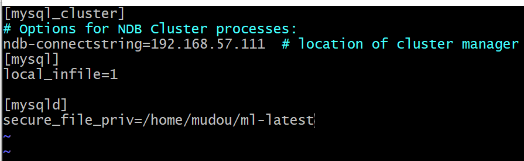
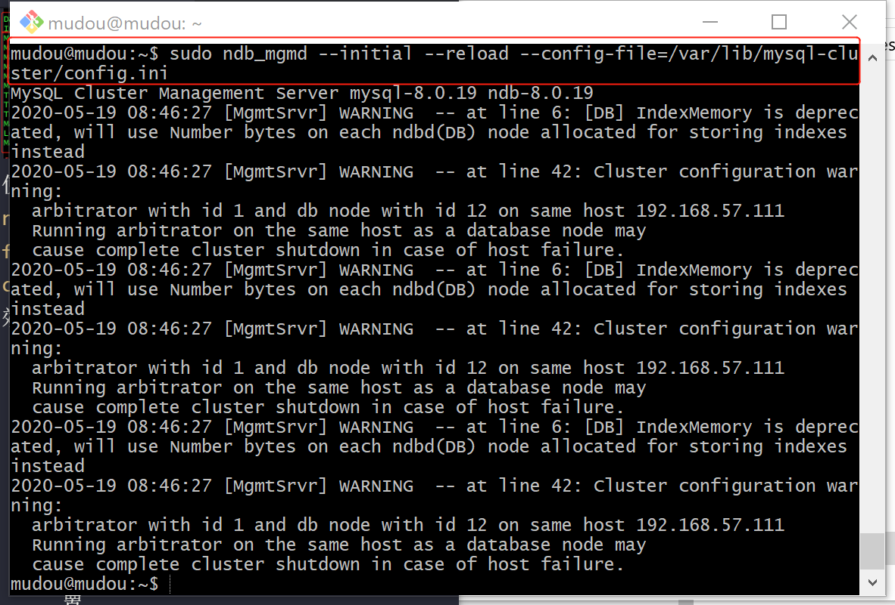

# 分组综合实验作业
##  实验要求
开发一个基于客户服务器或WEB的数据库应用，这个应用是查询一个关于电影数据库的数据，数据部分信息经过了脱密处理，数据及相关数据文档由教师指定。开发的基本功能需求如下：
- [] 1.	搜索任务：A：根据用户ID，搜索用户所看的电影名字和评分，按时间从新到旧排序，给出电影的前三个标签及关联度评分；B: 根据输入的关键词，查询电影名字里有关键词的电影。C：查询某一风格最受欢迎的20部电影（请给出你的最受欢迎的定义，风格数据处理较难，需要精心设计），D：根据性别推荐最受欢迎的电影20部电影。
- [] 2.	界面规范： 界面上应该有录入用户ID, 检索关键词、风格等的文本框和不同任务的提交按钮，风格最好提供选择框。 搜索结果要在网页上或客户端图形UI 展示，超过一页的要有滚动条。
- [] 3.	用户希望界面友好。
- [x] 4. 系统可以支持未来数据量的大幅增加。
- [] 5.	各组尽可能地做查询速度的优化，并在最后提交的文档中包含测试结果。
## 实验环境
python3.7.3+flask0.12.2+mysql cluster8.0.19(win10)的web数据库应用程序  

## 实验步骤
### 一. 在实验01-deploy-mysql的基础上配置mysql cluster，开启mysql cluster(配置时使用自启动)并确保一切正常。
服务器虚拟机（也是一个数据节点）执行：  
```
# 杀掉正在运行的服务
sudo pkill -f ndb_mgmd
# 检查ndb_mgmd 使用的端口 1186：
sudo netstat -plntu
# 启动管理器
sudo ndb_mgmd -f /var/lib/mysql-cluster/config.ini

# 最后，启动服务：
Shell> sudo systemctl start ndb_mgmd
# 可以通过如下语句验证NDB Cluster Management service服务正在执行：
Shell>sudo systemctl status ndb_mgmd


# 最后，启动数据节点服务：
sudo systemctl start ndbd
# 可以通过如下语句验证NDB Cluster Management service服务正在执行：
sudo systemctl status ndbd

# 启动mysql
sudo systemctl enable mysql

# 登录Cluster Manager / SQL Server节点(192.168.57.111)
mysql -u root -p  
# 显示 NDB引擎的相关信息
SHOW ENGINE NDB STATUS \G
# 退出。  
# 查看集群信息
ndb_mgm
SHOW
```
数据节点虚拟机执行：  
```
# 最后，启动数据节点服务：
sudo systemctl start ndbd
# 可以通过如下语句验证NDB Cluster Management service服务正在执行：
sudo systemctl status ndbd
```
### 二. 配置物理机远程连接虚拟机中的数据库,使用test.py进行数据测试。
>数据测试代码文件：code/test.py
1. virtualbox中进行如下设置：  

2. 运行python依然得到报错信息：'Host '192.168.57.1' is not allowed to connect to this MySQL server'.  
解决：参考[Host 'xxx.xx.xxx.xxx' is not allowed to connect to this MySQL server](https://stackoverflow.com/questions/1559955/host-xxx-xx-xxx-xxx-is-not-allowed-to-connect-to-this-mysql-server)对mysql cluster进行授权  
```
# 在虚拟机中操作
mysql -u root -p

#username为远程访问时要使用的
CREATE USER 'username'@'localhost' IDENTIFIED BY 'password';

GRANT ALL PRIVILEGES ON *.* TO 'username'@'localhost' WITH GRANT OPTION;

CREATE USER 'username'@'%' IDENTIFIED BY 'password';

GRANT ALL PRIVILEGES ON *.* TO 'username'@'%' WITH GRANT OPTION;

FLUSH PRIVILEGES;
```
本次实验创建username:mudou,localhost:192.168.57.1(host-only网络),password:123456
* 192.168.57.1的结果来自查看本次响应Host-only网络中的ipv4

具体mysql cluster授权实验操作如下：

3. 最后测试成功，看到打印出的数据，确实是当初插入其中的数据。(数据是在实验01-deploy-mysql中插入的数据) 

### 三、虚拟机中导入数据
* 为避免操作失误导致系统崩溃，快照一下
1. 下载老师给的数据包，文件都已经是UTF-8编码格式。 
2. ssh文件传入虚拟机  
3. 建库名为'movies'  
```create database movies；```

4. 建库建表导入数据
* 将数据cp到/var/lib/mysql-files/内
```
create database movies;
use movies;
```
导入enome-scores.csv
```
# genome-scores.csv
create table genomescores (movieId int,tagId int,relevance varchar(100))engine=ndbcluster;

mysql> load data infile '/var/lib/mysql-files/genome-scores.csv'
    -> into table genomescores
    -> fields terminated by ',' optionally enclosed by '"' escaped by '"'
    -> lines terminated by '\r\n'
    -> ignore 1 lines
    -> (movieId,tagId,relevance); 
```


```
# tags.csv
create table tags(userId int,movieId int,tag varchar(40),timestamps long)engine=ndbcluster;
```

```
# movies.csv
create table movies (movieId int,title varchar(100),genres varchar(300))engine=ndbcluster;

# users.csv
create table users(userId int,gender varchar(10),name varchar(20))engine=ndbcluster;

# ratings.csv
create table ratings(userId int,movieId int,rating double,timestamp long)engine=ndbcluster;
# 
```
### 四、前端搭建
## 实验问题
### 1. 物理机连接虚拟机报错
远程访问虚拟机数据时```grant all privileges on *.* to user@'%' identified by 'password';```一直报错。    
  
解决：因为没有create该用户，先create再授权。 而且一开始没有好好理解比如问题语句其中'user'和'%'的含义。   

### 2. 导入genome-scores.csv文件时遇到的问题与解决：  

建表正确命令：```create table genomescores (movieId int,tagId int,relevance double,primary key (movieId))engine=ndbcluster;```  
不需要''否则会报错，如下图。  
 
尝试用ndb_import向ndb中导入.csv的方式报错，此方法不可。于是采用向mysql导入.csv的方式。 

插入数据error1064报错，如下图。  
  
问题分析：多次尝试，参考[ERROR 1064 (42000): You have an error in your SQL syntax](https://blog.csdn.net/w1346561235/article/details/74502807)发现并不是语法的错误。
解决：参考[MySQL load data infile ERROR 1064](https://dba.stackexchange.com/questions/249637/mysql-load-data-infile-error-1064)，对'/etc/my.cnf'进行修改后保存,使用```service mysql restart```重启Mysql。修改后的/etc/my.cnf如下图所示：

* 之后解决table full时发现，此处更改没有效果是因为/etc/mysql/my.cnf还有一个文件，更改错了。

  
再次进入mysql，```show variables like "local_infile";```查看设置，发现没有成功,使用```set global local_infile=1;```后再次查看成功了。再次导入数据也没有出现这个错误。
   
再次导入数据，出现'secure_file-priv'的报错：  
  
分析：查看该变量值为空，那么就更改为我们想要的文件夹的位置。
解决：参考[Mysql 导入文件提示 --secure-file-priv option 问题](https://www.cnblogs.com/Braveliu/p/10728162.html)和[How should I tackle --secure-file-priv in MySQL?](https://stackoverflow.com/questions/32737478/how-should-i-tackle-secure-file-priv-in-mysql),在'etc/my.cnf'中进行如下图设置。保存后```service mysql restart```重启mysql。
 
* 注意是[mysqld]而不是[mysql]    

再次进入mysql，```show variables like "secure_file_priv"```查看变量值，出现了一个值。
  
* 在这里多次尝试，无论secure_file-priv为空还是固定的文件夹都还是会显示默认的'/var/lib/mysql-files/'

于是想着把数据cp到该默认文件夹内，再导入。出现了'Permission denied'。多次尝试失败后，参考[ubuntu下操作目录，出现Permission denied的解决办法](https://blog.csdn.net/zhengxiangwen/article/details/50625986),更改了'/var/lib/mysql-files'文件夹的权限，cp成功。操作结果如下图：    


再次插入数据，出现'ERROR 1265 (01000): Data truncated for column 'relevance' at row 1'报错。参考[Mysql 更新字段类型异常处理:ERROR 1265 (01000): Data truncated for column 'xxx' at row 1](https://blog.csdn.net/chwshuang/article/details/54945485)对数据进行更新，此办法失败。于是删表重建表，将'relevance'类型定义为varchar(20)。再次插入数据，出现某一行数据过长的报错,'ERROR 1406 (22001): Data too long for column 'relevance' at row 104'，删表重建表，将'relevance'类型定义为varchar(100)，此问题解决。
  
再次插入数据，出现双键报错'ERROR 1022 (23000): Can't write; duplicate key in table 'genomescores''，更改创建表语句，不使用primary key。正确语句为：```create table genomescores (movieId int,tagId int,relevance varchar(100))engine=ndbcluster;```
  
最后出现了'table full'的问题，跳转到问题3。  
### 3. 关于mysql-cluster导入数据时报错'table full'解决办法---实现扩容，达到作业要求【4系统可以支持未来数据量的大幅增加。】

如下图更改/etc/mysql/my.cnf和/etc/my.cnf: 
* tmp_table_size 控制内存临时表的最大值，超过限值后就往硬盘写，写的位置由变量tmpdir决定。
* max_heap_table_size 用户可以创建的内存表(memory table)的大小.这个值用来计算内存表的最大行数值。 

解决参考：[mysql 解决 ERROR 1114 (HY000): The table 'XXX' is full](https://www.cnblogs.com/wf-l5201314/p/11526452.html)
  
看到内存确实更改。  
  
再次插入数据这个报错都还是有。  
分析：突然意识到我们是mysql cluster，会不会数据管理上不一样，确实是的。  
解决：[参考](https://serverfault.com/questions/530015/ndb-cluster-table-is-full)  
```ndb_mgm -e shutdown ```关闭ndb_mgm.  
```sudo vim /var/lib/mysql-cluster/config.ini```如下图修改config.ini并保存。
* DataMemory：设定用于存放数据和主键索引的内存段的大小。这个大小限制了能存放的数据的大小，因为ndb存储引擎需属于内存数据库引擎，需要将所有的数据（包括索引）都load到内存中。这个参数并不是一定需要设定的，但是默认值非常小（80M），只也就是说如果使用默认值，将只能存放很小的数据。参数设置需要带上单位，如512M，2G等。另外，DataMemory里面还会存放UNDO相关的信息，所以，事务的大小和事务并发量也决定了DataMemory的使用量，建议尽量使用小事务；

* IndexMemory：设定用于存放索引（非主键）数据的内存段大小。和DataMemory类似，这个参数值的大小同样也会限制该节点能存放的数据的大小，因为索引的大小是随着数据量增长而增长的。参数设置也如DataMemory一样需要单位。IndexMemory默认大小为18M；

* 实际上，一个NDB节点能存放的数据量是会受到DataMemory和IndexMemory两个参数设置的约束，两者任何一个达到限制数量后，都无法再增加能存储的数据量。如果继续存入数据系统会报错“table is full”。


使用```sudo ndb_mgmd --initial --reload --config-file=/var/lib/mysql-cluster/config.ini```让配置文件生效，忽略warnings。
* ```sudo ndb_mgmd -f /var/lib/mysql-cluster/config.ini --reload```一开始执行此命令，设置的config.ini一直没生效，因为少了--initial,后来想想确实应该initial，是要还原设置再重新配置。


扩容前后大小对比图：  

### 4. 关于虚拟机的内存大小分配 
使用虚拟机时分配的内存不能过大，超出了物理机的能力，虚拟机会报错，而且物理机响声很大，差点烧板。  
但是也不能太小，不然数据节点就无法同时启用，启动的时候就看见两个机器的进程接着kill。  
多次尝试找到刚刚好的就行，刚刚好即开机后不再显示有xxx killed的信息，烧板声音太吓人。

### 5. 虚拟机硬盘大小不够扩容办法
使用以下方法对.vdi进行扩容  
  
.vdi扩容后的前后对比  

## 实验总结
1. 关于修改了my.cnf不生效问题总结。  
参考：[修改my.cnf配置不生效](https://www.kancloud.cn/thinkphp/mysql-faq/47452)  
MySQL读取各个my.cnf配置文件的先后顺序是：
* /etc/my.cnf
* /etc/mysql/my.cnf
* /usr/local/mysql/etc/my.cnf
* ~/.my.cnf
* 其他自定义路径下的my.cnf，例如：/data/mysql/yejr_3306/my.cnf

不管是mysqld服务器端程序，还是mysql客户端程序，都可以采用下面两个参数来自行指定要读取的配置文件路径：

* –defaults-file=#， 只读取指定的文件（不再读取其他配置文件）
* –defaults-extra-file=#， 从其他优先级更高的配置文件中读取全局配置后，再读取指定的配置文件（有些选项可以覆盖掉全局配置从的设定值）
2. 更改设置的时候出现了mysql和mysqld,傻傻分不清楚。  
参考：[mysqld — The MySQL Server](https://dev.mysql.com/doc/refman/8.0/en/mysqld.html)    
区分总结：mysqld 是服务端程序。
mysql是命令行客户端程序。
3. 关于一个应用的启动、停止、重启都有service或脚本启动两种方式。  

## 参考文献
[【MySQL集群】——在Windows环境下配置MySQL集群](https://blog.csdn.net/huyuyang6688/article/details/47441743)  
[MySQL Cluster: Getting Started](https://www.mysql.com/products/cluster/start.html)  
[NDB Cluster](https://en.wikipedia.org/wiki/NDB_Cluster)  
[解决VirtualBox中的MySQL数据库，Mac无法访问的问题（通过端口映射的方式）](https://blog.csdn.net/u010921373/article/details/70255427)  
[利用端口转发访问VirtualBox虚拟机中的MySQL](http://www.jeepxie.net/article/85094.html)  
[Differences Between MySQL vs MongoDB](https://www.educba.com/mysql-vs-mongodb/)  
[Differences Between MongoDB and HBase](https://www.educba.com/mongodb-vs-hbase/)  
[What is MySQL NDB Cluster?](https://www.apress.com/us/blog/all-blog-posts/what-is-mysql-ndb-cluster/15454530)  
[MySQL Cluster CGE ](https://www.mysql.com/products/cluster/)  
[ndb_import — Import CSV Data Into NDB](https://s0dev0mysql0com.icopy.site/doc/mysql-cluster-excerpt/5.7/en/mysql-cluster-programs-ndb-import.html)  
[LOAD DATA Statement](https://dev.mysql.com/doc/refman/5.6/en/load-data.html)  
[csv文件导入Mysql](https://blog.csdn.net/quiet_girl/article/details/71436108)  
[MySQL 使用 LOAD DATA 导入 csv 文件](https://blog.csdn.net/liqfyiyi/article/details/78831322)   
[MySQL Cluster配置详细介绍（config.ini）](https://www.linuxidc.com/Linux/2010-06/26640.htm)
